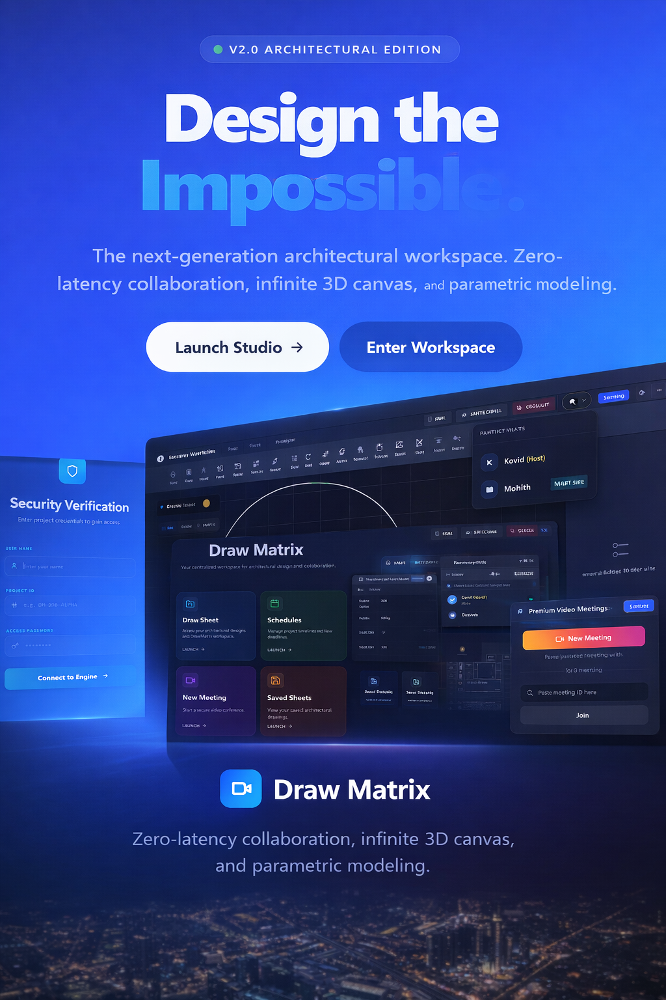

# DrawMatrix

Collaborative architectural drafting and CAD workspace built with Next.js, Zustand, Three.js, and Socket.IO.

## Local Setup

1. Install frontend dependencies in [drawmatrix_reference](./):
   `npm install`
2. Install backend dependencies in [server](../server):
   `npm install`
3. Copy [`.env.example`](./.env.example) to `.env.local` for the frontend.
4. Copy [`server/.env.example`](../server/.env.example) to `server/.env`.
5. Start everything from the workspace root:
   `npm run dev`

Local development runs:
- frontend on `http://localhost:3000`
- backend on `http://localhost:3001`
- CAD engine on `http://localhost:5000`

## Deployment

### Frontend

- Host [drawmatrix_reference](./) on Vercel.
- Required auth variables:
  `NEXTAUTH_URL`
  `NEXTAUTH_SECRET`
  `GOOGLE_CLIENT_ID`
  `GOOGLE_CLIENT_SECRET`
- Required app variables:
  `NEXT_PUBLIC_BACKEND_URL`
  `NEXT_PUBLIC_SOCKET_URL`
  `NEXT_PUBLIC_APP_URL`
- Optional integrations:
  `NEXT_PUBLIC_STREAM_API_KEY`
  `STREAM_SECRET_KEY`
  `NEXT_PUBLIC_ZEGO_APP_ID`
  `NEXT_PUBLIC_ZEGO_SERVER_SECRET`
  `NEXT_PUBLIC_CAD_ENGINE_URL`

For local development, the default CAD engine endpoint is:
`http://localhost:5000`

### Backend

- Host [server](../server) on Render, Railway, or another long-running Node host.
- Required variables:
  `PORT`
  `FRONTEND_URL`
  `NEXT_PUBLIC_APP_URL`

## Backend API Expectations

The frontend expects the backend to serve:

- `/health`
- `/api/projects`
- `/api/messages`
- `/api/schedules`
- `/api/presence`
- `/get-users`
- `/upsert-user`

## Quality Gates

- `npm run lint`
- `npx tsc --noEmit`
- `npm run build`

The frontend build now fails on real lint/type errors instead of skipping them.

